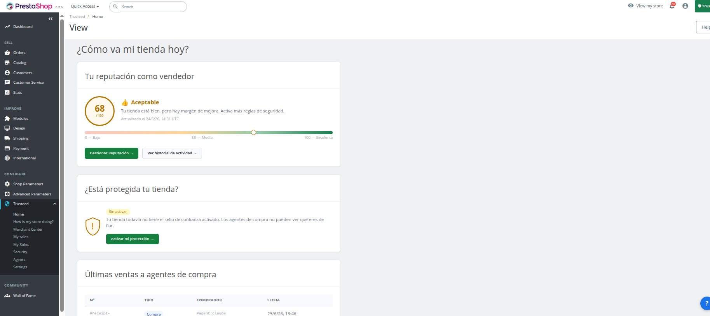
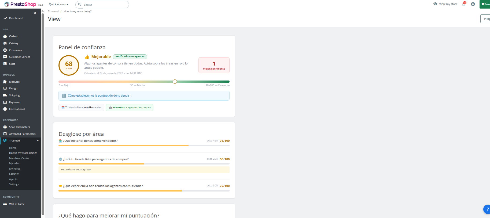
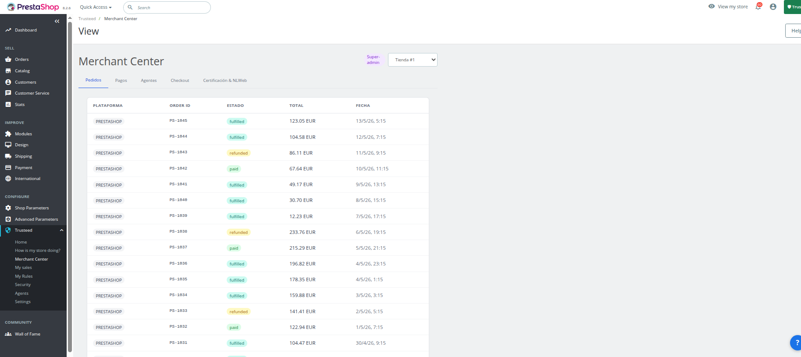
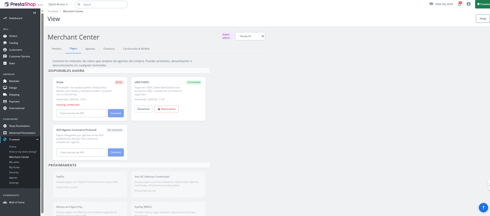
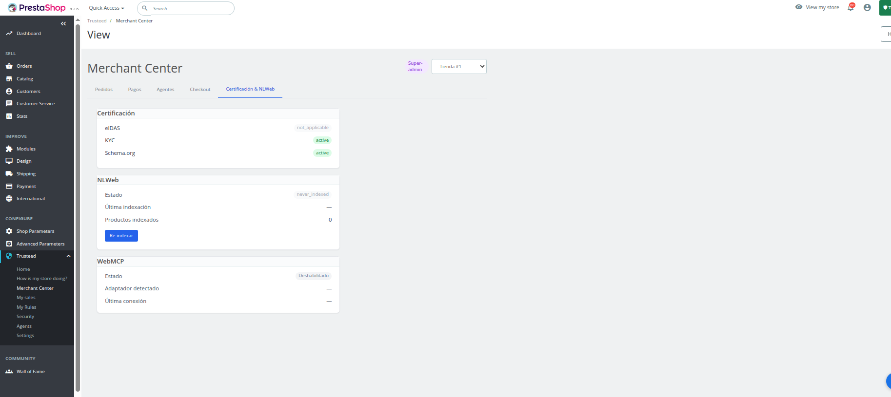
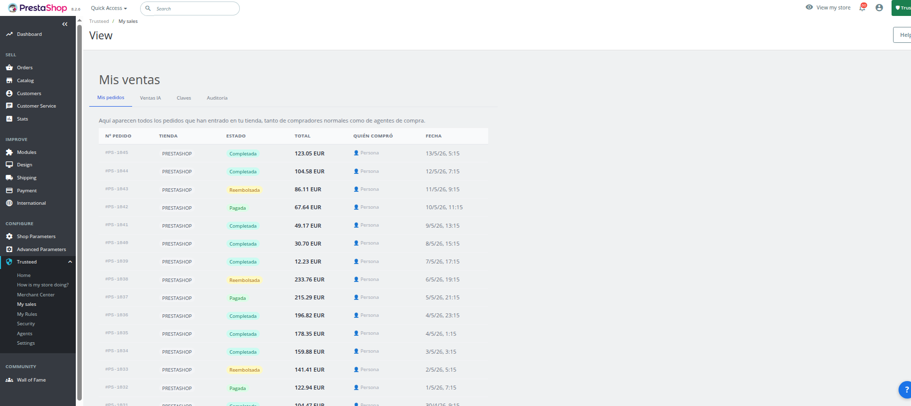
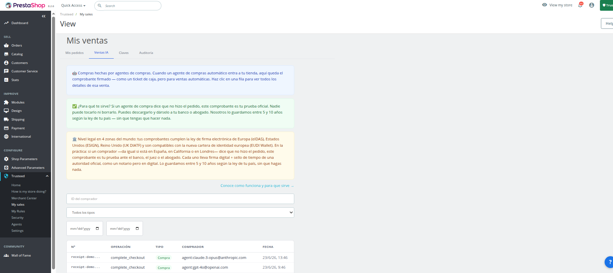
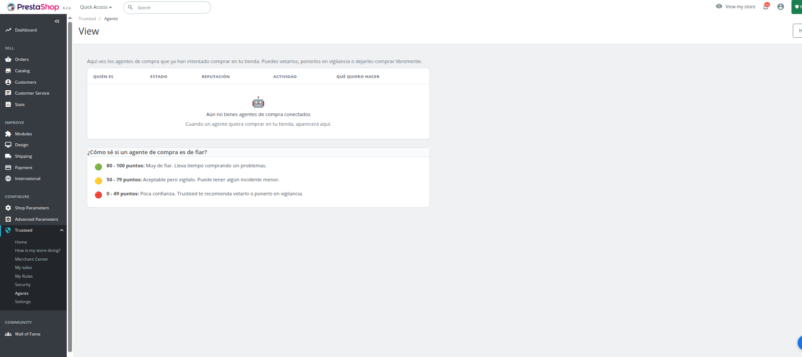

[English](README.md) | **Español** | [Français](README.fr.md) | [Deutsch](README.de.md)

# Trusteed AgenticTools para PrestaShop

Permite que los nuevos compradores online, los agentes de IA, realicen compras en tu tienda de forma segura y fiable gracias a Trusteed: la red que fomenta la confianza entre negocios y agentes.

- **Define tus reglas de negocio**: a quién permites comprar, hasta qué importe, qué categorías no quieres ofrecer a agentes, límites de precio, mantener niveles de stock para protegerte de posibles agentes fraudulentos, y más.
- **Recibos a prueba de manipulación**: generamos recibos firmados electrónicamente y criptográficamente a prueba de manipulación que sirven como prueba de la transacción real en caso de disputa. Compatible con las regulaciones eIDAS (UE, Reino Unido) y eSIGN (EE. UU.).
- **Analítica de agentes**: consulta estadísticas de las compras de agentes — cuánto gastan, qué productos compran y con qué frecuencia.
- **Bloqueo de agentes**: bloquea agentes potencialmente peligrosos o problemáticos.
- **Divisas digitales**: permite compras en divisas digitales gracias al protocolo X402.
- **Transacciones entre pares**: permite el comercio directo entre pares (peer-to-peer) entre agentes y comercios.

## Capturas de pantalla

| Inicio | Puntuación de confianza | Merchant Center — Pedidos |
|------|------------|--------------------------|
|  |  |  |

| Merchant Center — Métodos de pago | Merchant Center — Certificaciones | Mis Ventas |
|----------------------------|-----------------------------------|----------|
|  |  |  |

| Recibos de confianza (Mis Ventas → Ventas IA) | Agentes |
|---------------------------------------|--------|
|  |  |

Cada transacción de un agente genera un **recibo de confianza** firmado criptográficamente — un registro a prueba de manipulación (compatible con eIDAS / eSIGN) que aparece en **Mis Ventas → Ventas IA**.

## Funcionalidades

Trusteed AgenticTools consolida Trust Center, Merchant Center, herramientas agénticas MCP y enforcement de checkout en un único módulo de PrestaShop.

- **Trust Center** — recibos de confianza firmados, claves de firma, registro de auditoría, desglose de puntuación de confianza
- **Merchant Center** — pedidos, métodos de pago, agentes, reglas de checkout, estado de certificación y NLWeb
- **5 herramientas MCP nativas** para el add-on PrestaShop MCP Server (marketplace ID 96617): `trusteed_sign_trust_receipt`, `trusteed_verify_agent_signature`, `trusteed_dispatch_payment_acp`, `trusteed_dispatch_payment_ap2`, `trusteed_dispatch_payment_x402` — los agentes (Claude Desktop, etc.) pueden firmar recibos y despachar pagos directamente desde PrestaShop
- **Enforcement de checkout** — las reglas del comercio (importe máximo, países bloqueados, horario comercial y más) se aplican en cada checkout, con o sin agente
- **Evaluador offline de respaldo** — aplica las mismas reglas universales localmente cuando la API remota de reglas no está disponible, en lugar de un simple permitir/bloquear por defecto
- **Auto-registro self-serve** — registro de la tienda en un clic; las credenciales también pueden pegarse manualmente
- **Por defecto fail-closed** — el enforcement nunca permite silenciosamente cuando está mal configurado

## Compatibilidad

| Componente | Compatible |
|-----------|-----------|
| PrestaShop | 8.0.0 – 9.99.99 |
| PHP | 8.1+ |

## Requisitos

- PrestaShop 8.0.0 o superior
- PHP 8.1 o superior
- Una cuenta de Trusteed — [regístrate gratis en trusteed.xyz](https://trusteed.xyz)

## Instalación

### Subida manual

1. Descarga el código fuente desde la [página de Releases](https://github.com/Trusteedxyz/agentic-commerce-prestashop/releases) más reciente (o haz `git clone` de este repositorio).
2. Renombra la carpeta raíz extraída a `trusteed` (PrestaShop exige que el nombre de la carpeta coincida con el nombre técnico del módulo) y vuelve a comprimirla en un `.zip`.
3. En tu **Back Office** de PrestaShop: **Módulos → Gestor de módulos → Subir un módulo**.
4. Selecciona el `trusteed.zip` que acabas de crear y haz clic en **Subir este módulo**.
5. Haz clic en **Configurar**.

### Vía Composer (para desarrollo)

```bash
git clone https://github.com/Trusteedxyz/agentic-commerce-prestashop.git trusteed
cd trusteed
composer install --no-dev --optimize-autoloader
```
Después sube la carpeta `trusteed/` resultante como `.zip` según lo descrito arriba. El módulo también incluye un autoloader PSR-4 de respaldo, por lo que funcionará incluso sin un directorio `vendor/` (el `composer install` es opcional, no obligatorio).

## Configuración

1. Inicia sesión en tu **Back Office** de PrestaShop.
2. Ve a **Módulos → Trusteed AgenticTools → Configurar**.
3. Haz clic en **Auto-registrar esta tienda** (registro en un clic que rellena automáticamente el Merchant ID y el secreto), o pega manualmente tu **Merchant ID** y **S2S secret** desde [app.trusteed.xyz/settings](https://app.trusteed.xyz/settings).
4. Guarda — el módulo comprueba la conectividad y empieza a sincronizar las reglas de enforcement.

### Claves de configuración

| Clave | Por defecto | Propósito |
|-----|---------|-------------|
| `TRUSTEED_API_BASE` | `https://api.trusteed.xyz` | Endpoint del backend de Trusteed |
| `TRUSTEED_CEL_MERCHANT_ID` | _(vacío)_ | Merchant ID emitido por Trusteed |
| `TRUSTEED_EMBED_S2S_SECRET` | _(vacío)_ | Secreto servidor-a-servidor para la API de embed/enforcement |
| `TRUSTEED_BOOTSTRAP_TOKEN` | _(vacío)_ | Token embed-bootstrap heredado (reemplazado por el auto-registro) |

## Páginas de administración

Tras la instalación aparece un menú **Trusteed** en la barra lateral del Back Office de PrestaShop:

| Página | Descripción |
|------|-------------|
| Inicio | Resumen de reputación y ventas recientes |
| Trust Center | Recibos firmados, claves de firma, registro de auditoría, puntuación de confianza |
| Merchant Center | Pedidos, métodos de pago, agentes, certificaciones, NLWeb |
| Mis Ventas | Lista de pedidos y recibos de confianza IA |
| Reglas | Reglas de enforcement de checkout |
| Agentes | Identidades de agentes conectados |
| Seguridad | Registro de auditoría y alertas de anomalías |
| Config | Ajustes del módulo y auto-registro |

## Preguntas frecuentes

**¿Qué datos se envían?** Solo lo que requieren las reglas de enforcement y los recibos de confianza (importes de pedido, país, identidad del agente). Ningún dato de tarjeta de pago pasa por Trusteed. Toda la comunicación usa HTTPS.

**¿Qué agentes son compatibles?** Cualquier agente conectado a través del add-on PrestaShop MCP Server (marketplace ID 96617), incluyendo Claude Desktop y otros clientes compatibles con MCP.

**¿Ralentiza mi tienda?** No. El enforcement de checkout se ejecuta de forma síncrona solo en la validación del pedido, con un respaldo local offline cuando la API remota no está disponible.

## Historial de cambios

### 2.0.0

**Importante:** este release reemplaza el contenido publicado por error bajo `v1.0.0` en este repositorio — se había publicado un módulo distinto e independiente ("Trusteed Trust Center") en lugar de este módulo de enforcement de checkout + AgenticTools. Este es el primer release correcto.

- **Corrección** — el enforcement de checkout se saltaba por completo en checkouts orgánicos (sin agente): reglas del comercio como el importe máximo, países bloqueados y horario comercial nunca se ejecutaban salvo que hubiera un token de agente presente. Estas reglas ahora se aplican en todos los checkouts, con o sin agente.
- **Añadido** — un evaluador offline de respaldo que aplica las mismas reglas universales localmente cuando la API remota de evaluación de reglas no está disponible.
- **Añadido** — auto-registro self-serve (registro de la tienda en un clic, además del flujo manual de pegar credenciales ya existente).
- Rebrand técnico completo de `mcpwebstore`/`Mcpwebstore` a `trusteed`/`Trusteed`: namespace PSR-4, nombre técnico del módulo, constantes de configuración y los nombres de las 5 herramientas MCP que invocan los agentes.

## Soporte

- Email de soporte: support@trusteed.xyz
- Issues en GitHub: [github.com/Trusteedxyz/agentic-commerce-prestashop/issues](https://github.com/Trusteedxyz/agentic-commerce-prestashop/issues)

## Licencia

MIT. Ver [LICENSE](LICENSE) para el texto completo.
