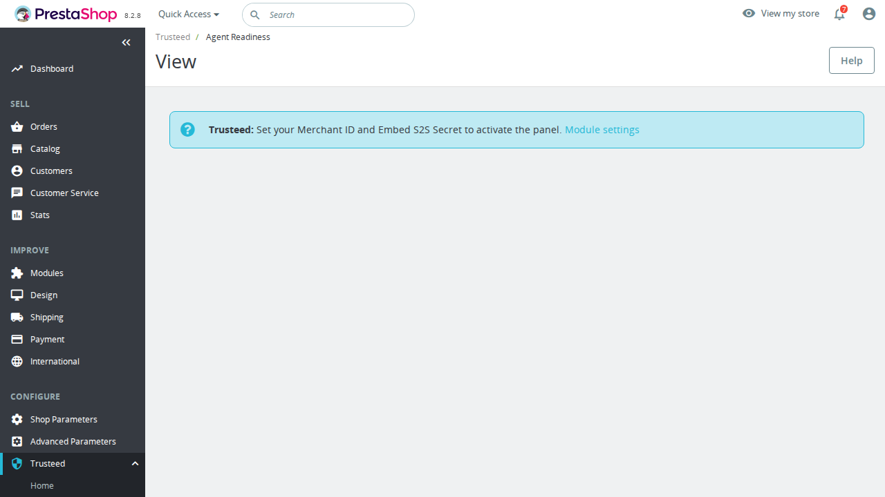

[English](README.md) | **Español** | [Français](README.fr.md) | [Deutsch](README.de.md)

# Trusteed AgenticTools para PrestaShop

Los agentes de IA son un tipo nuevo de comprador online. Con Trusteed, la red que conecta a negocios y agentes, pueden comprar en tu tienda con las condiciones que tú fijes.

- Define tus reglas de negocio: a quién dejas comprar, hasta qué importe, qué categorías no quieres ofrecer a los agentes, límites de precio, niveles de stock que te protejan de agentes fraudulentos, y más.
- Recibe recibos firmados. Cada transacción genera un recibo firmado criptográficamente, en el que cualquier manipulación se puede detectar, y que te sirve como prueba de la compra si hay una disputa. Alineado con eIDAS (UE) y con eSIGN (EE. UU.).
- Consulta lo que hacen los agentes: cuánto gastan, qué productos compran y con qué frecuencia.
- Bloquea a los agentes que parezcan peligrosos o den problemas.
- Acepta compras en divisas digitales mediante el protocolo X402.
- Deja que agentes y comercios comercien directamente entre pares (peer-to-peer).
- Comprueba si los agentes pueden comprar hoy en tu tienda: el panel de preparación para agentes muestra tres vistas independientes (lo que dicen otros, lo que prometes frente a lo que haces y lo que hemos observado) y nunca las fusiona en una sola puntuación.

## Capturas de pantalla

| Inicio                                       | Puntuación de confianza                                 | Merchant Center — Pedidos                             |
| -------------------------------------------- | ------------------------------------------------------- | ----------------------------------------------------- |
|  |  |  |

| Merchant Center — Métodos de pago                      | Merchant Center — Certificaciones                                     | Mis Ventas                                        |
| ------------------------------------------------------ | --------------------------------------------------------------------- | ------------------------------------------------- |
|  |  |  |

| Recibos de confianza (Mis Ventas → Ventas IA)       | Agentes                               |
| --------------------------------------------------- | ------------------------------------- |
|  |  |

| Detalle del comprobante — descarga en ZIP                                | Agent Readiness                                        |
| ------------------------------------------------------------------------ | ------------------------------------------------------ |
|  |  |

Cada transacción de un agente genera un recibo de confianza firmado, un registro en el que cualquier manipulación se puede detectar (alineado con eIDAS y con eSIGN) que aparece en **Mis Ventas → Ventas IA**. Haz clic en una fila para ver el detalle: ID del agente, herramienta invocada, hashes de entrada y salida, JWS. También puedes descargar el recibo como ZIP y conservarlo como tu propia evidencia de lo que hizo el agente. El recibo se firma con un JWS Ed25519, así que cualquier cambio posterior en su contenido se puede detectar. No es una firma ni un sello electrónico cualificado: hoy no hay detrás ningún certificado emitido por un QTSP ni un sello de tiempo cualificado, por lo que por sí solo no tiene presunción de validez legal.

## Funcionalidades

Trusteed AgenticTools reúne Trust Center, Merchant Center, herramientas agénticas MCP y enforcement de checkout en un único módulo de PrestaShop.

- Trust Center: recibos de confianza firmados, claves de firma, registro de auditoría, desglose de la puntuación de confianza.
- Merchant Center: pedidos, métodos de pago, agentes, reglas de checkout, estado de certificación y de NLWeb.
- 5 herramientas MCP nativas para el add-on PrestaShop MCP Server (marketplace ID 96617): `trusteed_sign_trust_receipt`, `trusteed_verify_agent_signature`, `trusteed_dispatch_payment_acp`, `trusteed_dispatch_payment_ap2`, `trusteed_dispatch_payment_x402`. Los agentes (Claude Desktop y otros) pueden firmar recibos y despachar pagos directamente desde PrestaShop.
- Enforcement de checkout: las reglas del comercio (importe máximo, países bloqueados, horario comercial y más) se aplican en cada checkout, con o sin agente.
- Evaluador offline de respaldo: aplica las mismas reglas universales en local cuando la API remota de reglas no está disponible, en lugar de un permitir/bloquear genérico por defecto.
- Auto-registro self-serve: registro de la tienda en Trusteed con un clic. También puedes pegar las credenciales a mano.
- Comportamiento configurable ante caídas: cuando la API de reglas no responde y no hay una copia local reciente, el módulo viene en modo `balanced`. Deja pasar el checkout y registra esa decisión. Pon `TRUSTEED_CEL_FALLBACK_MODE` en `strict` si prefieres que lo bloquee.

## Compatibilidad

| Componente | Rango declarado                                              | Verificado de verdad contra                                                            |
| ---------- | ------------------------------------------------------------ | -------------------------------------------------------------------------------------- |
| PrestaShop | 8.0.0 – 9.99.99 (`ps_versions_compliancy` en `trusteed.php`) | 8.2.0 (todas las capturas de este README; sin E2E automatizado en otras versiones aún) |
| PHP        | 8.1+                                                         | 8.1, 8.2                                                                               |

El rango 8.0.0–9.99.99 es lo que el módulo _declara_ al gestor de módulos de PrestaShop —
no se ha probado de extremo a extremo fuera de 8.2.0. Todavía no hay CI corriendo PHPUnit
contra varias versiones de PrestaShop; trata el soporte de 9.x como no verificado hasta que
exista.

## Requisitos

- PrestaShop 8.0.0 o superior
- PHP 8.1 o superior
- Una cuenta de Trusteed ([regístrate gratis en trusteed.xyz](https://trusteed.xyz))

## Instalación

### Subida manual

1. **Descarga el `.zip` instalable** desde el último Release de GitHub:
   [**⬇ Descargar la última versión**](https://github.com/Trusteedxyz/agentic-commerce-prestashop/releases/latest)
   o consulta todas las versiones en la [página de Releases](https://github.com/Trusteedxyz/agentic-commerce-prestashop/releases).
2. En tu **Back Office** de PrestaShop: **Módulos → Gestor de módulos → Subir un módulo**.
3. Selecciona el `.zip` descargado y haz clic en **Subir este módulo**.
4. Haz clic en **Configurar**.

### Desde el código fuente (compilar el zip tú mismo)

```bash
git clone https://github.com/Trusteedxyz/agentic-commerce-prestashop.git
cd agentic-commerce-prestashop
bash bin/build-zip.sh   # genera dist/trusteed-agentic-commerce-prestashop-<versión>.zip
```

El módulo incluye un autoloader PSR-4 de respaldo para el namespace `Trusteed\`, así que funciona incluso sin un directorio `vendor/`. El script de build no lo incluye y `composer install` es opcional.

### Vía Composer (opcional, para herramientas de IDE / desarrollo local)

```bash
git clone https://github.com/Trusteedxyz/agentic-commerce-prestashop.git trusteed
cd trusteed
composer install --no-dev --optimize-autoloader
```

Después sube la carpeta `trusteed/` resultante como `.zip` según lo descrito arriba. En producción puedes saltarte este paso; mira la nota del autoloader de respaldo más arriba.

## Configuración

1. Inicia sesión en tu **Back Office** de PrestaShop.
2. Ve a **Módulos → Trusteed AgenticTools → Configurar**.
3. Haz clic en **Auto-registrar esta tienda** (registro en un clic que rellena automáticamente el Merchant ID y el secreto), o pega manualmente tu **Merchant ID** y **S2S secret** desde [trusteed.xyz/dashboard/settings](https://trusteed.xyz/dashboard/settings).
4. Guarda. Se validan los valores (endpoint HTTPS, secreto de 64 caracteres hex) y se almacenan. Guardar **no** contacta con Trusteed; solo **Auto-registrar esta tienda** hace una llamada real.

### Claves de configuración

| Clave                          | Por defecto                | Propósito                                                                                                                                                                           |
| ------------------------------ | -------------------------- | ----------------------------------------------------------------------------------------------------------------------------------------------------------------------------------- |
| `TRUSTEED_API_BASE`            | `https://api.trusteed.xyz` | Endpoint del backend de Trusteed                                                                                                                                                    |
| `TRUSTEED_CEL_MERCHANT_ID`     | _(vacío)_                  | Merchant ID emitido por Trusteed                                                                                                                                                    |
| `TRUSTEED_EMBED_S2S_SECRET`    | _(vacío)_                  | Secreto servidor-a-servidor para la API de embed/enforcement                                                                                                                        |
| `TRUSTEED_BOOTSTRAP_TOKEN`     | _(vacío)_                  | Token embed-bootstrap heredado (reemplazado por el auto-registro)                                                                                                                   |
| `TRUSTEED_CEL_ENABLED`         | `0`                        | Interruptor general del enforcement de checkout. Mientras valga `0`, no se evalúa ninguna regla en ningún checkout                                                                  |
| `TRUSTEED_CEL_INSTALLATION_ID` | _(vacío)_                  | ID de instalación para la copia firmada de reglas                                                                                                                                   |
| `TRUSTEED_CEL_HMAC_SECRET`     | _(vacío)_                  | Secreto HMAC para las llamadas de copia de reglas y de evaluación                                                                                                                   |
| `TRUSTEED_CEL_FALLBACK_MODE`   | `balanced`                 | Comportamiento cuando la API de reglas no responde y no hay copia local: `balanced` y `permissive` dejan pasar el checkout y registran el permitir-por-defecto, `strict` lo bloquea |

El enforcement permanece completamente inerte hasta que `TRUSTEED_CEL_ENABLED` valga `1` **y** estén puestas las tres claves `TRUSTEED_CEL_MERCHANT_ID`, `TRUSTEED_CEL_INSTALLATION_ID` y `TRUSTEED_CEL_HMAC_SECRET` — si falta cualquiera de ellas, el módulo deja pasar todos los checkouts sin evaluar una sola regla.

## Páginas de administración

Tras la instalación aparece un menú **Trusteed** en la barra lateral del Back Office de PrestaShop:

| Página                       | Descripción                                                                       |
| ---------------------------- | --------------------------------------------------------------------------------- |
| Inicio                       | Resumen de reputación y ventas recientes                                          |
| ¿Cómo va mi tienda?          | Recibos firmados, claves de firma, registro de auditoría, puntuación de confianza |
| Centro de comercio           | Pedidos, métodos de pago, agentes, certificaciones, NLWeb                         |
| Mis ventas                   | Lista de pedidos y recibos de confianza IA                                        |
| Mis Reglas                   | Reglas de enforcement de checkout                                                 |
| Seguridad                    | Registro de auditoría y alertas de anomalías                                      |
| Agentes                      | Identidades de agentes conectados                                                 |
| ¿Pueden comprar los agentes? | Si los agentes pueden comprar de verdad en esta tienda                            |
| Configuración                | Ajustes del módulo y auto-registro                                                |

## Preguntas frecuentes

**¿Qué datos se envían?** Solo lo que requieren las reglas de enforcement y los recibos de confianza: importes de pedido, país e identidad del agente. Ningún dato de tarjeta de pago pasa por Trusteed. Toda la comunicación usa HTTPS.

**¿Qué agentes son compatibles?** Cualquier agente conectado a través del add-on PrestaShop MCP Server (marketplace ID 96617), incluidos Claude Desktop y otros clientes compatibles con MCP.

**¿Ralentiza mi tienda?** No. El enforcement de checkout se ejecuta de forma síncrona solo en la validación del pedido, con un respaldo local offline cuando la API remota no está disponible.

## El panel de preparación agéntica

**¿Me encuentran los agentes?** es una página de tu panel de administración.
Responde a una sola pregunta: cuando un agente de compra con IA visita tu
tienda, ¿encuentra lo que tú crees que encuentra?

La página nunca enseña una nota única. Tiene tres columnas y no las promedia,
porque responden a preguntas distintas y pueden contradecirse entre sí:

| Columna                                      | Qué es                                                                                                                                                                              |
| -------------------------------------------- | ----------------------------------------------------------------------------------------------------------------------------------------------------------------------------------- |
| **Lo que dice un tercero**                   | El veredicto de un escáner externo, citado tal cual. Nunca lo convertimos a una escala nuestra, porque reescalar la nota de otro sería corregir nuestro propio examen             |
| **¿Coincide lo que dices con lo que haces?** | 16 comprobaciones que contrastan lo que tu tienda **anuncia** con lo que **responde de verdad**. Ningún escáner externo puede hacer esta parte, porque necesita tus credenciales |
| **Lo que hemos visto pasar**                 | Tráfico agéntico real en la ventana elegida: qué agentes llegaron, qué herramientas usaron, hasta dónde llegaron y dónde fallaron                                                   |

Si una comprobación no se ha podido hacer, la página la marca como **sin
comprobar** y da el motivo. Nunca se descarta ni cuenta como aprobada. «No hemos
podido mirar» y «hemos mirado y está bien» son respuestas distintas, y la página
te dice cuál estás leyendo.

### Qué mira cada comprobación

| Comprobación | Qué detecta                                                          |
| ------------ | -------------------------------------------------------------------- |
| C1           | Anuncias herramientas que tu tienda no sirve                         |
| C2           | Anuncias un protocolo de compra cuyo endpoint no responde            |
| C3           | El precio del catálogo no es el que se cobra                         |
| C4           | Se anuncia disponible lo que no lo está                              |
| C5           | Tu política de devoluciones dice cosas distintas según dónde se mire |
| C6           | Anuncias como disponible algo que está apagado                       |
| C7           | Reglas activadas que no pueden actuar por falta de datos             |
| C8           | Tus reglas observan pero no bloquean                                 |
| C9           | La forma de identificarse que anuncias no funciona                   |
| C10          | Un agente puede comprar cualquier importe sin tu confirmación        |
| C11          | El punto de venta usa reglas caducadas                               |
| C12          | Operaciones sin comprobante firmado                                  |
| C13          | Direcciones anunciadas que no funcionan                              |
| C14          | Los agentes ven datos desfasados de tu tienda                        |
| C15          | Credenciales de identidad a punto de caducar                         |
| C16          | El plazo de entrega que prometes no es el que cumples                |

Algunas comprobaciones necesitan algo más que tu configuración para ejecutarse, y
la página lo dice en vez de dejar un hueco:

- Necesita tu tienda conectada (C3, C4, C5, C14). Comparan contra tu catálogo
  real, y sin credenciales no hay con qué comparar.
- Necesita pedidos entregados (C16). Compara lo que prometes con lo que has
  cumplido, y eso exige historial.
- Esta vez no había nada que comparar. C12, por ejemplo, no tiene nada que mirar
  hasta que un agente completa una compra. Eso no es un suspenso.

Las comprobaciones se ejecutan una vez al día y la página enseña cada resultado
con su fecha, para que el veredicto de ayer se vea como el de ayer. Presentar
como actual un «todo bien» guardado sería justo el autoengaño que esta página
existe para cazar.

## Historial de cambios

### 2.3.1 — Corrección de seguridad

- Corregido: una petición con una firma de token de agente malformada podía hacer que el módulo se saltara todas las reglas del checkout en vez de rechazar la petición. Reportado de forma responsable por Salúa Es-sair. Ver [GHSA-2j2x-5q52-g48m](https://github.com/Trusteedxyz/agentic-commerce-prestashop/security/advisories/GHSA-2j2x-5q52-g48m).
- Corregido: el mismo fallo lo podía disparar cualquier compra humana, no solo agentes: una llamada incorrecta a la API de PrestaShop hacía que ninguna regla del comercio se evaluara nunca en un pedido normal del escaparate.
- Nuevo: pulsar «Actualizar» ahora sí refresca el override del núcleo del módulo en disco. Antes sólo lo hacía una instalación nueva.

### 2.3.0

- Nuevo: el indicador de la barra superior ahora tiene tres estados. Antes sólo aparecía **después** de configurar el módulo, así que instalarlo y no terminar no producía ninguna señal. Ahora avisa si falta configurarlo, y avisa aparte si la tienda está registrada pero el enforcement de checkout no está activo.
- Corregido: el auto-registro decía «credenciales configuradas automáticamente» habiendo configurado dos de las cinco claves que el módulo usa. Ahora dice cuáles configura, y avisa de que el enforcement necesita dos valores más que el auto-registro no puede emitir.
- Nuevo: si la URL de tu tienda ya estaba registrada con otra clave de instalación, el módulo puede demostrar que controla el dominio y recuperarla. Antes ese caso no tenía salida: pedía una clave que nunca habías tenido.

### 2.2.4

- Nuevo: cuando una comprobación no se pudo ejecutar, el panel ahora explica qué la desbloquearía (nada que hacer, hay que configurar algo, falta esperar datos, o ha fallado una comprobación nuestra) en vez de una lista plana de grises sin explicar.
- Nuevo: el panel ahora muestra qué servidor nuestro respondió a tu petición, una etiqueta corta y opaca. Útil para comparar lo que ves aquí con lo que ve soporte; nunca revela un nombre de host o de servicio.

### 2.2.3

- Nuevo: en Ajustes puedes elegir qué herramientas sirve tu tienda a los agentes. Si nunca has guardado una lista, el panel te dice que lo que sirve es el conjunto básico que trae la plataforma, y no una elección tuya.
- Nuevo: un botón para volver a comprobar sin esperar al barrido diario, y el panel recuerda qué ha cambiado desde la comprobación anterior.
- Cambiado: nuestras propias averías dejan de contarse como incoherencias de tu tienda. El panel las separa, porque no puedes hacer nada con ellas.

### 2.2.2

- Corregido: la página de disponibilidad para agentes se publicaba sin su hoja de estilos, así que el panel salía sin formato.
- Corregido: el panel podía mostrar la carcasa en un idioma y el diagnóstico en otro. El idioma resuelto viaja ahora junto a los textos, en vez de detectarse dos veces por separado.
- Nuevo: cada hallazgo lleva un enlace a donde se corrige, y las afirmaciones del comercio (el plazo de entrega y las demás) aparecen con el respaldo que tiene cada una.
- Cambiado: una tienda sin ninguna comprobación todavía se lee como «comprobando» en lugar de «se comprueba una vez al día»: abrir el panel ya lanza la primera comprobación en segundo plano.

### 2.2.1

- Corregido: la página «Agent Readiness» enseñaba Inicio. `resolveSection()` valida contra una lista blanca en la que `agent-readiness` nunca se añadió, así que caía en silencio.
- Corregido: dos avisos del panel (falta configuración, faltan los recursos) estaban escritos en castellano duro y se enseñaban a todos los comerciantes fuera cual fuera el idioma de su back office. Uno de ellos le pedía al comerciante ejecutar un comando de compilación desde un monorepo, cosa que ningún comerciante puede hacer. Los dos pasan ahora por el traductor del módulo.

### 2.2.0

- Nuevo: panel de preparación agéntica. _¿Me encuentran los agentes?_ llega al panel de administración. Contrasta lo que tu tienda anuncia con lo que responde de verdad, en 16 comprobaciones, y las enseña las dieciséis, no solo las que fallan. Una comprobación que no se ha podido hacer dice por qué (tienda sin conectar, todavía sin pedidos entregados, nada que comparar esta vez) en vez de dejar un hueco que se lee como avería. Ver «El panel de preparación agéntica» más arriba.
- Corregido: el diagnóstico se escribía en castellano dentro de la API y se mostraba tal cual, así que un comerciante con el panel en inglés leía encabezados en inglés y hallazgos en castellano. Las comprobaciones emiten ahora códigos neutros de idioma y el texto se compone al servirlo, en el idioma que estés usando.
- Corregido: la comprobación C1 («anuncias herramientas que tu tienda no sirve») daba por servido el catálogo público entero cuando no había lista de herramientas configurada: informaba de 46 de 48 respondiendo cuando el servidor sirve 12. Fallaba en la dirección aduladora, que es justo la que este panel existe para cazar.
- Corregido: la comprobación C6 («anuncias como disponible algo que está apagado») daba una capacidad por apagada siempre que su bandera no estuviera puesta, incluso en banderas que están encendidas por defecto. Era una falsa alarma en todas las tiendas.

### 2.1.1

- Corregido: el bundle del panel de administración (`views/js/admin-spa.js`) se distribuía sin minificar: 869 KB / 25.064 líneas en vez de los 490 KB / 41 líneas que produce el comando de build documentado (`pnpm run build:ps`). Su procedencia no se podía verificar. Reconstruido desde la fuente.
- Corregido: la regla R047 (pedir confirmación al comprador a partir de un importe) no tenía campo en el panel de administración: sus parámetros existían en el esquema pero solo se podían configurar por API.

### 2.1.0

- Corrección de seguridad: el verificador de tokens de agente trataba `exp`, `iat` y `nonce` como opcionales. Todas las protecciones que dependen de ellos (caducidad, el tope de vida de 330s, el anti-replay) colgaban de un `isset`, así que un token que simplemente OMITÍA el claim se saltaba la comprobación: sin `exp` era válido para siempre, y sin `nonce` no se deduplicaba nada. Los tres son ahora obligatorios (`nonce` de 16 a 64 caracteres), igual que en el esquema canónico del token.
- Corrección de seguridad: un `iat` en el futuro se rechaza. Combinado con el tope de vida de 330s daba una ventana deslizante: un `iat` una hora por delante compraba una hora de validez de reloj de pared aunque `exp - iat` siguiera dentro del tope.
- Corrección: la regla R036 (valor máximo por línea) leía su tope de un parámetro llamado `maxCents`, copiado de R035. El nombre canónico es `maxCentsPerLine`, y es el único que acepta el esquema estricto del panel del comerciante, así que la regla no podía dispararse nunca.
- Eliminado: la rama R007 del evaluador offline. Bloqueaba con `trustScore < 0.3` bajo un comentario que decía "comprobación de país de alto riesgo", así que ni hacía lo que afirmaba el comentario ni lo que significa el nombre canónico de la regla. La señal real de R007 es el estado de abuso entre comercios, que vive en la base de datos del backend y a la que el camino offline no llega. Devolver ALLOW aquí no es fallar abierto sobre una señal disponible, porque la señal no existe en este contexto. El veredicto autoritativo de R007 lo da el servidor. Si lo que se quería era el umbral de confianza, la regla es R006; si era el país, R014/R019.
- Novedad: el módulo informa ahora de qué señales de carrito sabe proyectar esta instalación (`POST /api/v1/enforcement/capabilities`, firmado con HMAC, una vez por versión del módulo desde un hook de back-office ya registrado). Sin eso, una regla cuya señal no llega devuelve `NO_SIGNAL` en cada compra: pasa en silencio, y el comerciante ve una regla en ENFORCE que no bloquea nada.

### 2.0.1

- Corrección: bundle del SPA de administración reconstruido (Fase A de evidencia de disputas: la lista real de recibos ahora se monta en Mis Ventas, igual que en Magento y WooCommerce).
- Añadido: script de empaquetado `bin/build-zip.sh`. El `.zip` instalable ahora se publica como asset del Release de GitHub, así que el comercio ya no tiene que compilarlo por su cuenta.

### 2.0.0

**Importante:** este release reemplaza el contenido publicado por error bajo `v1.0.0` en este repositorio. Se había publicado un módulo distinto e independiente («Trusteed Trust Center») en lugar de este módulo de enforcement de checkout y AgenticTools. Este es el primer release correcto.

- Corrección: el enforcement de checkout se saltaba por completo en checkouts orgánicos (sin agente). Reglas del comercio como el importe máximo, países bloqueados y horario comercial nunca se ejecutaban salvo que hubiera un token de agente presente. Estas reglas ahora se aplican en todos los checkouts, con o sin agente.
- Añadido: un evaluador offline de respaldo que aplica las mismas reglas universales localmente cuando la API remota de evaluación de reglas no está disponible.
- Añadido: auto-registro self-serve (registro de la tienda en un clic, además del flujo manual de pegar credenciales que ya existía).
- Rebrand técnico completo de `mcpwebstore`/`Mcpwebstore` a `trusteed`/`Trusteed`: namespace PSR-4, nombre técnico del módulo, constantes de configuración y los nombres de las 5 herramientas MCP que invocan los agentes.

## Soporte

- Email de soporte: support@trusteed.xyz
- Issues en GitHub: [github.com/Trusteedxyz/agentic-commerce-prestashop/issues](https://github.com/Trusteedxyz/agentic-commerce-prestashop/issues)

## Licencia

MIT. Ver [LICENSE](LICENSE) para el texto completo.
