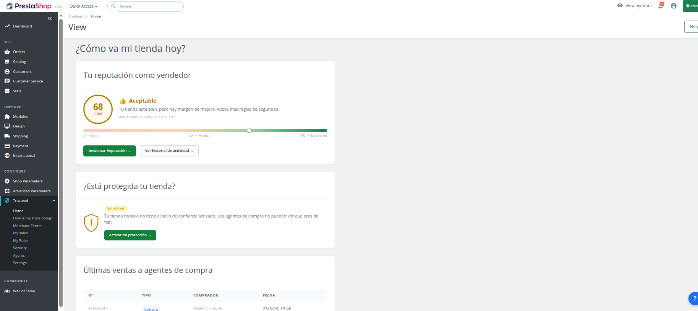
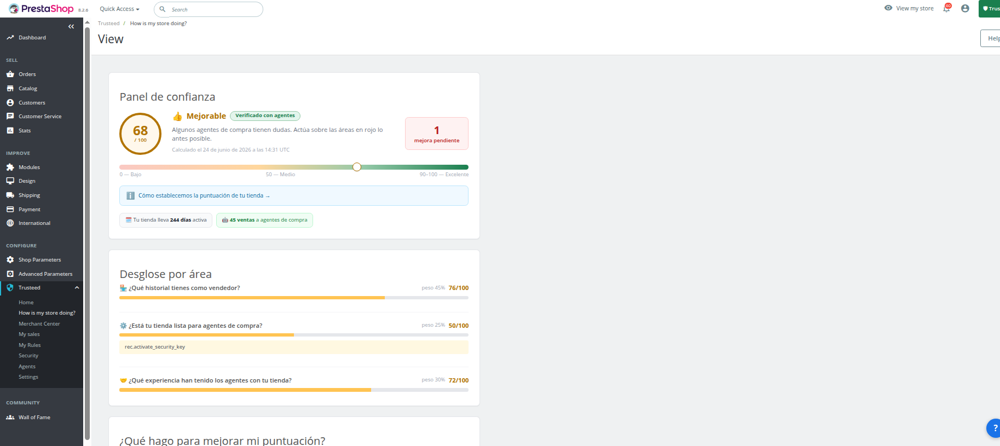
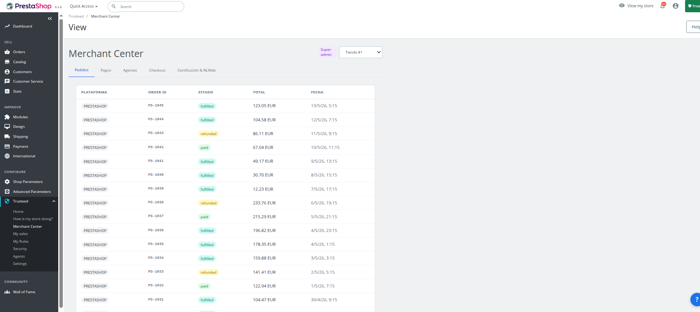
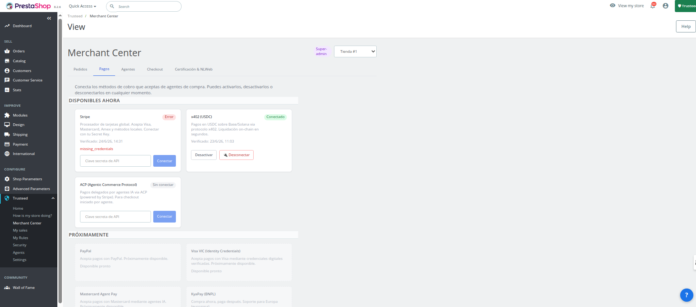
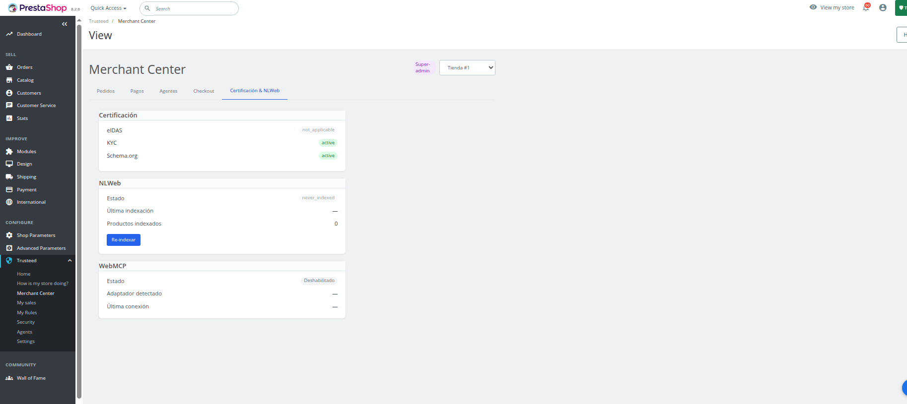
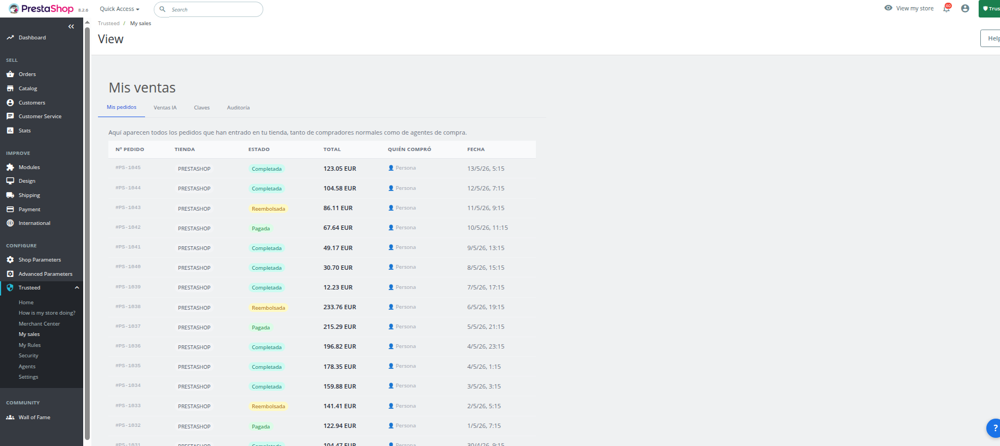
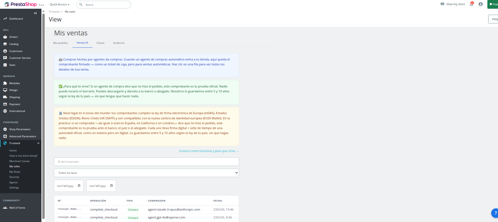
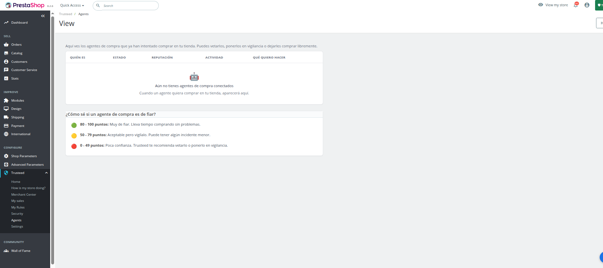
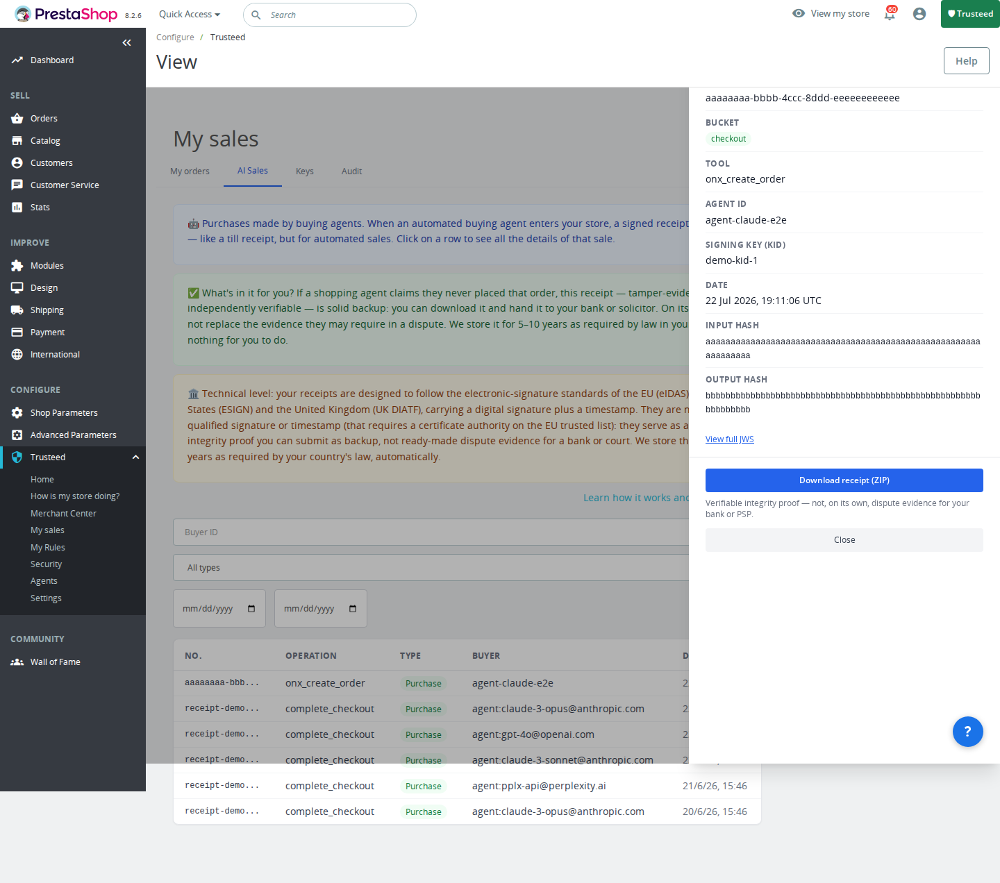

[English](README.md) | **Español** | [Français](README.fr.md) | [Deutsch](README.de.md)

# Trusteed AgenticTools para PrestaShop

Permite que los nuevos compradores online, los agentes de IA, realicen compras en tu tienda de forma segura y fiable gracias a Trusteed: la red que fomenta la confianza entre negocios y agentes.

- **Define tus reglas de negocio**: a quién permites comprar, hasta qué importe, qué categorías no quieres ofrecer a agentes, límites de precio, mantener niveles de stock para protegerte de posibles agentes fraudulentos, y más.
- **Recibos a prueba de manipulación**: generamos recibos firmados electrónicamente y criptográficamente a prueba de manipulación que sirven como prueba de la transacción real en caso de disputa. Compatible con las regulaciones eIDAS (UE, Reino Unido) y eSIGN (EE. UU.).
- **Analítica de agentes**: consulta estadísticas de las compras de agentes — cuánto gastan, qué productos compran y con qué frecuencia.
- **Bloqueo de agentes**: bloquea agentes potencialmente peligrosos o problemáticos.
- **Divisas digitales**: permite compras en divisas digitales gracias al protocolo X402.
- **Transacciones entre pares**: permite el comercio directo entre pares (peer-to-peer) entre agentes y comercios.

## Capturas de pantalla

| Inicio | Puntuación de confianza | Merchant Center — Pedidos |
|------|------------|--------------------------|
|  |  |  |

| Merchant Center — Métodos de pago | Merchant Center — Certificaciones | Mis Ventas |
|----------------------------|-----------------------------------|----------|
|  |  |  |

| Recibos de confianza (Mis Ventas → Ventas IA) | Agentes |
|---------------------------------------|--------|
|  |  |

| Detalle del comprobante — descarga en ZIP |
|--------------------------------------------|
|  |

Cada transacción de un agente genera un **recibo de confianza** — un registro firmado con un JWS Ed25519, de modo que cualquier cambio posterior en su contenido queda detectable — que aparece en **Mis ventas → Ventas IA**. Haz clic en cualquier fila para ver el detalle completo (ID del agente, herramienta invocada, hashes de entrada/salida, JWS) y descargar el comprobante como ZIP para conservarlo como tu propia evidencia de lo que hizo el agente. Los recibos usan los mismos formatos de firma sobre los que se construyen eIDAS y eSIGN, pero **no** son firmas ni sellos electrónicos cualificados: hoy no hay detrás ningún certificado emitido por un QTSP ni sello de tiempo cualificado, así que por sí solos no tienen presunción de validez legal.

## Funcionalidades

Trusteed AgenticTools consolida Trust Center, Merchant Center, herramientas agénticas MCP y enforcement de checkout en un único módulo de PrestaShop.

- **Trust Center** — recibos de confianza firmados, claves de firma, registro de auditoría, desglose de puntuación de confianza
- **Merchant Center** — pedidos, métodos de pago, agentes, reglas de checkout, estado de certificación y NLWeb
- **5 herramientas MCP nativas** para el add-on PrestaShop MCP Server (marketplace ID 96617): `trusteed_sign_trust_receipt`, `trusteed_verify_agent_signature`, `trusteed_dispatch_payment_acp`, `trusteed_dispatch_payment_ap2`, `trusteed_dispatch_payment_x402` — los agentes (Claude Desktop, etc.) pueden firmar recibos y despachar pagos directamente desde PrestaShop
- **Enforcement de checkout** — las reglas del comercio (importe máximo, países bloqueados, horario comercial y más) se aplican en cada checkout, con o sin agente
- **Evaluador offline de respaldo** — aplica las mismas reglas universales localmente cuando la API remota de reglas no está disponible, en lugar de un simple permitir/bloquear por defecto
- **Auto-registro self-serve** — registro de la tienda en un clic; las credenciales también pueden pegarse manualmente
- **Comportamiento configurable ante caídas** — cuando la API de reglas no responde y no hay copia local reciente, el módulo viene en modo `balanced`: deja pasar el checkout y registra ese permitir-por-defecto. Pon `TRUSTEED_CEL_FALLBACK_MODE` en `strict` si prefieres que lo bloquee.

## Compatibilidad

| Componente | Compatible |
|-----------|-----------|
| PrestaShop | 8.0.0 – 9.99.99 |
| PHP | 8.1+ |

## Requisitos

- PrestaShop 8.0.0 o superior
- PHP 8.1 o superior
- Una cuenta de Trusteed — [regístrate gratis en trusteed.xyz](https://trusteed.xyz)

## Instalación

### Subida manual

1. **Descarga el `.zip` instalable** desde el último Release de GitHub:
   [**⬇ Descargar la última versión**](https://github.com/Trusteedxyz/agentic-commerce-prestashop/releases/latest)
   — o consulta todas las versiones en la [página de Releases](https://github.com/Trusteedxyz/agentic-commerce-prestashop/releases).
2. En tu **Back Office** de PrestaShop: **Módulos → Gestor de módulos → Subir un módulo**.
3. Selecciona el `.zip` descargado y haz clic en **Subir este módulo**.
4. Haz clic en **Configurar**.

### Desde el código fuente (compilar el zip tú mismo)

```bash
git clone https://github.com/Trusteedxyz/agentic-commerce-prestashop.git
cd agentic-commerce-prestashop
bash bin/build-zip.sh   # genera dist/trusteed-agentic-commerce-prestashop-<versión>.zip
```

El módulo incluye un autoloader PSR-4 de respaldo para el namespace `Trusteed\`, por lo que funciona correctamente incluso sin un directorio `vendor/` (el script de build no lo incluye — `composer install` es opcional, no obligatorio).

### Vía Composer (opcional, para herramientas de IDE / desarrollo local)

```bash
git clone https://github.com/Trusteedxyz/agentic-commerce-prestashop.git trusteed
cd trusteed
composer install --no-dev --optimize-autoloader
```
Después sube la carpeta `trusteed/` resultante como `.zip` según lo descrito arriba. No es necesario para producción — ver la nota del autoloader de respaldo arriba.

## Configuración

1. Inicia sesión en tu **Back Office** de PrestaShop.
2. Ve a **Módulos → Trusteed AgenticTools → Configurar**.
3. Haz clic en **Auto-registrar esta tienda** (registro en un clic que rellena automáticamente el Merchant ID y el secreto), o pega manualmente tu **Merchant ID** y **S2S secret** desde [trusteed.xyz/dashboard/settings](https://trusteed.xyz/dashboard/settings).
4. Guarda — se validan los valores (endpoint HTTPS, secreto de 64 caracteres hex) y se almacenan. Guardar **no** contacta con Trusteed; sólo **Auto-registrar esta tienda** hace una llamada real.

### Claves de configuración

| Clave | Por defecto | Propósito |
|-----|---------|-------------|
| `TRUSTEED_API_BASE` | `https://api.trusteed.xyz` | Endpoint del backend de Trusteed |
| `TRUSTEED_CEL_MERCHANT_ID` | _(vacío)_ | Merchant ID emitido por Trusteed |
| `TRUSTEED_EMBED_S2S_SECRET` | _(vacío)_ | Secreto servidor-a-servidor para la API de embed/enforcement |
| `TRUSTEED_BOOTSTRAP_TOKEN` | _(vacío)_ | Token embed-bootstrap heredado (reemplazado por el auto-registro) |
| `TRUSTEED_CEL_ENABLED` | `0` | Interruptor general del enforcement de checkout. Mientras valga `0`, no se evalúa ninguna regla en ningún checkout |
| `TRUSTEED_CEL_INSTALLATION_ID` | _(vacío)_ | ID de instalación para la copia firmada de reglas |
| `TRUSTEED_CEL_HMAC_SECRET` | _(vacío)_ | Secreto HMAC para las llamadas de copia de reglas y de evaluación |
| `TRUSTEED_CEL_FALLBACK_MODE` | `balanced` | Comportamiento cuando la API de reglas no responde y no hay copia local: `balanced` y `permissive` dejan pasar el checkout y registran el permitir-por-defecto, `strict` lo bloquea |

El enforcement permanece completamente inerte hasta que `TRUSTEED_CEL_ENABLED` valga `1` **y** estén puestas las tres claves `TRUSTEED_CEL_MERCHANT_ID`, `TRUSTEED_CEL_INSTALLATION_ID` y `TRUSTEED_CEL_HMAC_SECRET` — si falta cualquiera de ellas, el módulo deja pasar todos los checkouts sin evaluar una sola regla.

## Páginas de administración

Tras la instalación aparece un menú **Trusteed** en la barra lateral del Back Office de PrestaShop:

| Página | Descripción |
|------|-------------|
| Inicio | Resumen de reputación y ventas recientes |
| ¿Cómo va mi tienda? | Recibos firmados, claves de firma, registro de auditoría, puntuación de confianza |
| Centro de comercio | Pedidos, métodos de pago, agentes, certificaciones, NLWeb |
| Mis ventas | Lista de pedidos y recibos de confianza IA |
| Mis Reglas | Reglas de enforcement de checkout |
| Seguridad | Registro de auditoría y alertas de anomalías |
| Agentes | Identidades de agentes conectados |
| Configuración | Ajustes del módulo y auto-registro |

## Preguntas frecuentes

**¿Qué datos se envían?** Solo lo que requieren las reglas de enforcement y los recibos de confianza (importes de pedido, país, identidad del agente). Ningún dato de tarjeta de pago pasa por Trusteed. Toda la comunicación usa HTTPS.

**¿Qué agentes son compatibles?** Cualquier agente conectado a través del add-on PrestaShop MCP Server (marketplace ID 96617), incluyendo Claude Desktop y otros clientes compatibles con MCP.

**¿Ralentiza mi tienda?** No. El enforcement de checkout se ejecuta de forma síncrona solo en la validación del pedido, con un respaldo local offline cuando la API remota no está disponible.

## Historial de cambios

### 2.1.1

- **Corregido** — el bundle del panel de administración (`views/js/admin-spa.js`) se distribuía sin minificar: 869 KB / 25.064 líneas en vez de los 490 KB / 41 líneas que produce el comando de build documentado (`pnpm run build:ps`). Su procedencia no se podía verificar. Reconstruido desde la fuente.
- **Corregido** — la regla R047 (pedir confirmación al comprador a partir de un importe) no tenía campo en el panel de administración: sus parámetros existían en el esquema pero solo se podían configurar por API.

### 2.1.0

- **Corrección de seguridad** — el verificador de tokens de agente trataba `exp`, `iat` y `nonce` como opcionales. Todas las protecciones que dependen de ellos —caducidad, el tope de vida de 330s, el anti-replay— colgaban de un `isset`, así que un token que simplemente OMITÍA el claim se saltaba la comprobación: sin `exp` era válido para siempre, y sin `nonce` no se deduplicaba nada. Los tres son ahora obligatorios (`nonce` de 16 a 64 caracteres), igual que en el esquema canónico del token.
- **Corrección de seguridad** — un `iat` en el futuro se rechaza. Combinado con el tope de vida de 330s daba una ventana deslizante: un `iat` una hora por delante compraba una hora de validez de reloj de pared aunque `exp - iat` siguiera dentro del tope.
- **Corrección** — la regla R036 (valor máximo por línea) leía su tope de un parámetro llamado `maxCents`, copiado de R035. El nombre canónico es `maxCentsPerLine`, y es el único que acepta el esquema estricto del panel del comerciante, así que la regla no podía dispararse nunca.
- **Eliminado** — la rama R007 del evaluador offline. Bloqueaba con `trustScore < 0.3` bajo un comentario que decía "comprobación de país de alto riesgo", así que ni hacía lo que afirmaba el comentario ni lo que significa el nombre canónico de la regla. La señal real de R007 es el estado de abuso entre comercios, que vive en la base de datos del backend y a la que el camino offline no llega — devolver ALLOW aquí no es fallar abierto sobre una señal disponible, es que la señal no existe en este contexto. El veredicto autoritativo de R007 lo da el servidor. Si lo que se quería era el umbral de confianza, la regla es R006; si era el país, R014/R019.
- **Novedad** — el módulo informa ahora de qué señales de carrito sabe proyectar esta instalación (`POST /api/v1/enforcement/capabilities`, firmado con HMAC, una vez por versión del módulo desde un hook de back-office ya registrado). Sin eso, una regla cuya señal no llega devuelve `NO_SIGNAL` en cada compra: pasa en silencio, y el comerciante ve una regla en ENFORCE que no bloquea nada.

### 2.0.1

- **Corrección** — bundle del SPA de administración reconstruido (Fase A de evidencia de disputas: la lista real de recibos ahora se monta en Mis Ventas, igual que en Magento/WooCommerce).
- **Añadido** — script de empaquetado `bin/build-zip.sh`; el `.zip` instalable ahora se publica como asset del Release de GitHub en vez de requerir que el comercio lo compile por su cuenta.

### 2.0.0

**Importante:** este release reemplaza el contenido publicado por error bajo `v1.0.0` en este repositorio — se había publicado un módulo distinto e independiente ("Trusteed Trust Center") en lugar de este módulo de enforcement de checkout + AgenticTools. Este es el primer release correcto.

- **Corrección** — el enforcement de checkout se saltaba por completo en checkouts orgánicos (sin agente): reglas del comercio como el importe máximo, países bloqueados y horario comercial nunca se ejecutaban salvo que hubiera un token de agente presente. Estas reglas ahora se aplican en todos los checkouts, con o sin agente.
- **Añadido** — un evaluador offline de respaldo que aplica las mismas reglas universales localmente cuando la API remota de evaluación de reglas no está disponible.
- **Añadido** — auto-registro self-serve (registro de la tienda en un clic, además del flujo manual de pegar credenciales ya existente).
- Rebrand técnico completo de `mcpwebstore`/`Mcpwebstore` a `trusteed`/`Trusteed`: namespace PSR-4, nombre técnico del módulo, constantes de configuración y los nombres de las 5 herramientas MCP que invocan los agentes.

## Soporte

- Email de soporte: support@trusteed.xyz
- Issues en GitHub: [github.com/Trusteedxyz/agentic-commerce-prestashop/issues](https://github.com/Trusteedxyz/agentic-commerce-prestashop/issues)

## Licencia

MIT. Ver [LICENSE](LICENSE) para el texto completo.
