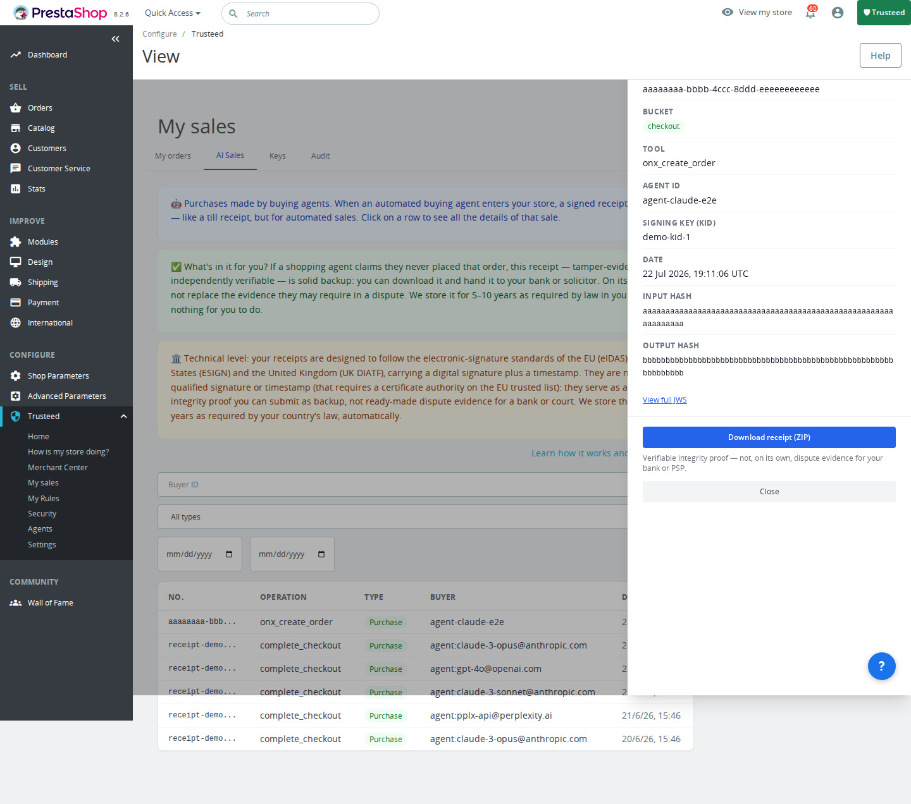

[English](README.md) | [Español](README.es.md) | **Français** | [Deutsch](README.de.md)

# Trusteed AgenticTools pour PrestaShop

Permettez aux nouveaux acheteurs en ligne, les agents IA, d'effectuer des achats dans votre boutique de manière sûre et fiable grâce à Trusteed : le réseau qui instaure la confiance entre les entreprises et les agents.

- **Définissez vos règles commerciales** : qui vous autorisez à acheter, jusqu'à quel montant, quelles catégories vous ne souhaitez pas proposer aux agents, fixez des limites de prix, maintenez des niveaux de stock pour vous protéger d'agents potentiellement frauduleux, et plus encore.
- **Reçus infalsifiables** : nous générons des reçus signés électroniquement et infalsifiables cryptographiquement qui servent de preuve de la transaction réelle en cas de litige. Compatible avec les réglementations eIDAS (UE, Royaume-Uni) et eSIGN (États-Unis).
- **Analyse des agents** : consultez les statistiques des achats des agents — combien ils dépensent, quels produits ils achètent et à quelle fréquence.
- **Blocage d'agents** : bloquez les agents potentiellement dangereux ou problématiques.
- **Monnaies numériques** : permet les achats en monnaies numériques grâce au protocole X402.
- **Transactions pair-à-pair** : permet le commerce direct pair-à-pair entre agents et commerçants.

## Captures d'écran

| Accueil | Score de confiance | Merchant Center — Commandes |
|------|------------|--------------------------|
|  |  |  |

| Merchant Center — Moyens de paiement | Merchant Center — Certifications | Mes Ventes |
|----------------------------|-----------------------------------|----------|
|  |  |  |

| Reçus de confiance (Mes Ventes → Ventes IA) | Agents |
|---------------------------------------|--------|
|  |  |

| Détail du reçu — téléchargement en ZIP |
|------------------------------------------|
|  |

Chaque transaction d'un agent génère un **reçu de confiance** signé cryptographiquement — un enregistrement infalsifiable (compatible eIDAS / eSIGN) répertorié sous **Mes Ventes → Ventes IA**. Cliquez sur une ligne pour voir le détail complet (ID de l'agent, outil appelé, hachages d'entrée/sortie, JWS) et télécharger le reçu au format ZIP à fournir en cas de litige.

## Fonctionnalités

Trusteed AgenticTools regroupe Trust Center, Merchant Center, les outils agentiques MCP et l'application des règles de commande (enforcement) au sein d'un seul module PrestaShop.

- **Trust Center** — reçus de confiance signés, clés de signature, journal d'audit, détail du score de confiance
- **Merchant Center** — commandes, moyens de paiement, agents, règles de commande, statut de certification & NLWeb
- **5 outils MCP natifs** pour l'extension PrestaShop MCP Server (marketplace ID 96617) : `trusteed_sign_trust_receipt`, `trusteed_verify_agent_signature`, `trusteed_dispatch_payment_acp`, `trusteed_dispatch_payment_ap2`, `trusteed_dispatch_payment_x402` — les agents (Claude Desktop, etc.) peuvent signer des reçus et déclencher des paiements directement depuis PrestaShop
- **Application des règles au checkout** — les règles du commerçant (montant maximal, pays bloqués, horaires d'ouverture, et plus) s'appliquent à chaque commande, agent ou humain
- **Évaluateur de secours hors ligne** — applique les mêmes règles universelles localement lorsque l'API distante est injoignable, au lieu d'un simple repli autoriser/bloquer
- **Auto-enregistrement en libre-service** — enregistrement de la boutique en un clic ; les identifiants peuvent aussi être saisis manuellement
- **Comportement par défaut fail-closed** — l'application des règles n'autorise jamais silencieusement en cas de mauvaise configuration

## Compatibilité

| Composant | Compatible |
|-----------|-----------|
| PrestaShop | 8.0.0 – 9.99.99 |
| PHP | 8.1+ |

## Prérequis

- PrestaShop 8.0.0 ou supérieur
- PHP 8.1 ou supérieur
- Un compte Trusteed — [inscrivez-vous gratuitement sur trusteed.xyz](https://trusteed.xyz)

## Installation

### Téléversement manuel

1. **Téléchargez le `.zip` installable** depuis la dernière Release GitHub :
   [**⬇ trusteed-agentic-commerce-prestashop-2.0.1.zip**](https://github.com/Trusteedxyz/agentic-commerce-prestashop/releases/latest/download/trusteed-agentic-commerce-prestashop-2.0.1.zip)
   — ou parcourez toutes les versions sur la [page des Releases](https://github.com/Trusteedxyz/agentic-commerce-prestashop/releases).
2. Dans votre **Back Office** PrestaShop : **Modules → Gestionnaire de modules → Téléverser un module**.
3. Sélectionnez le `.zip` téléchargé et cliquez sur **Téléverser ce module**.
4. Cliquez sur **Configurer**.

### Depuis les sources (compiler le zip vous-même)

```bash
git clone https://github.com/Trusteedxyz/agentic-commerce-prestashop.git
cd agentic-commerce-prestashop
bash bin/build-zip.sh   # génère dist/trusteed-agentic-commerce-prestashop-<version>.zip
```

Le module intègre un autoloader PSR-4 de secours pour l'espace de noms `Trusteed\`, il fonctionne donc correctement même sans dossier `vendor/` (le script de build n'en inclut pas — `composer install` est facultatif, pas obligatoire).

### Via Composer (facultatif, pour l'outillage IDE / le développement local)

```bash
git clone https://github.com/Trusteedxyz/agentic-commerce-prestashop.git trusteed
cd trusteed
composer install --no-dev --optimize-autoloader
```
Téléversez ensuite le dossier `trusteed/` obtenu sous forme de `.zip` comme décrit ci-dessus. Non requis pour la production — voir la note sur l'autoloader de secours ci-dessus.

## Configuration

1. Connectez-vous à votre **Back Office** PrestaShop.
2. Allez dans **Modules → Trusteed AgenticTools → Configurer**.
3. Cliquez sur **Auto-enregistrer cette boutique** (enregistrement en un clic qui remplit automatiquement le Merchant ID et le secret), ou saisissez manuellement votre **Merchant ID** et votre **secret S2S** depuis [app.trusteed.xyz/settings](https://app.trusteed.xyz/settings).
4. Enregistrez — le module teste la connectivité et commence à synchroniser les règles d'application.

### Clés de configuration

| Clé | Par défaut | Rôle |
|-----|---------|-------------|
| `TRUSTEED_API_BASE` | `https://api.trusteed.xyz` | Point de terminaison du backend Trusteed |
| `TRUSTEED_CEL_MERCHANT_ID` | _(vide)_ | Merchant ID délivré par Trusteed |
| `TRUSTEED_EMBED_S2S_SECRET` | _(vide)_ | Secret serveur-à-serveur pour l'API embed/enforcement |
| `TRUSTEED_BOOTSTRAP_TOKEN` | _(vide)_ | Jeton embed-bootstrap hérité (remplacé par l'auto-enregistrement) |

## Pages d'administration

Après l'installation, un menu **Trusteed** apparaît dans la barre latérale du Back Office PrestaShop :

| Page | Description |
|------|-------------|
| Accueil | Aperçu de la réputation et des ventes récentes |
| Trust Center | Reçus signés, clés de signature, journal d'audit, score de confiance |
| Merchant Center | Commandes, moyens de paiement, agents, certifications, NLWeb |
| Mes Ventes | Liste des commandes et reçus de confiance IA |
| Règles | Règles d'application au checkout |
| Agents | Identités des agents connectés |
| Sécurité | Journal d'audit et alertes d'anomalies |
| Config | Paramètres du module et auto-enregistrement |

## FAQ

**Quelles données sont envoyées ?** Uniquement ce que nécessitent les règles d'application et les reçus de confiance (montants des commandes, pays, identité de l'agent). Aucune donnée de carte bancaire ne transite jamais par Trusteed. Toutes les communications utilisent HTTPS.

**Quels agents sont pris en charge ?** Tout agent connecté via l'extension PrestaShop MCP Server (marketplace ID 96617), y compris Claude Desktop et d'autres clients compatibles MCP.

**Cela ralentit-il ma boutique ?** Non. L'application des règles au checkout s'exécute de manière synchrone uniquement lors de la validation de la commande, avec un repli local hors ligne lorsque l'API distante est injoignable.

## Historique des versions

### 2.0.0

**Important :** cette version remplace le contenu publié par erreur sous `v1.0.0` dans ce dépôt — un module distinct et autonome ("Trusteed Trust Center") avait été publié à la place de ce module d'application des règles de commande + AgenticTools. Il s'agit de la première version correcte.

- **Correction** — l'application des règles au checkout était entièrement ignorée pour les commandes organiques (sans agent) : les règles du commerçant telles que le montant maximal, les pays bloqués et les horaires d'ouverture ne s'exécutaient jamais en l'absence d'un jeton d'agent. Ces règles s'appliquent désormais à chaque commande, agent ou humain.
- **Ajout** — un évaluateur de secours hors ligne qui applique localement les mêmes règles universelles lorsque l'API distante d'évaluation des règles est injoignable.
- **Ajout** — auto-enregistrement en libre-service (enregistrement de la boutique en un clic, en plus du flux manuel existant de saisie des identifiants).
- Rebranding technique complet de `mcpwebstore`/`Mcpwebstore` vers `trusteed`/`Trusteed` : namespace PSR-4, nom technique du module, constantes de configuration et noms des 5 outils MCP appelés par les agents.

## Support

- Email de support : support@trusteed.xyz
- Issues GitHub : [github.com/Trusteedxyz/agentic-commerce-prestashop/issues](https://github.com/Trusteedxyz/agentic-commerce-prestashop/issues)

## Licence

MIT. Voir [LICENSE](LICENSE) pour le texte complet.
