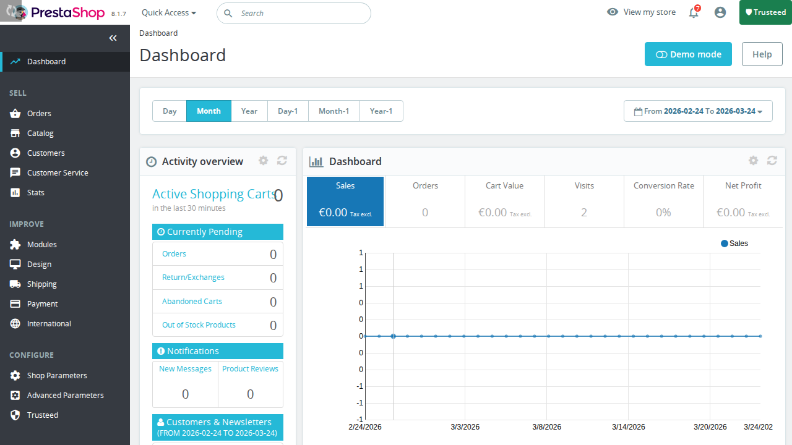
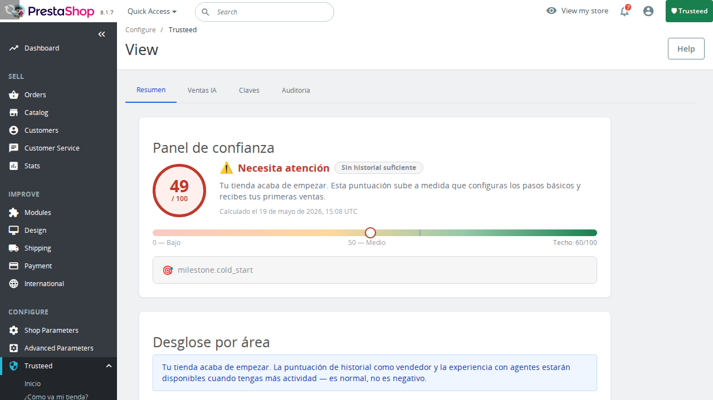

# Trusteed Agentic Commerce for PrestaShop

Enable new online shoppers, AI agents, to make purchases in your store securely and reliably thanks to Trusteed: the network that fosters trust between businesses and agents.

- **Set your business rules**: who you allow to buy, up to what amount, which categories you don't want to offer to agents, set price limits, maintain stock levels to protect yourself against potential fraudulent agents, and more.
- **Tamper-proof receipts**: we generate electronically signed and cryptographically tamper-proof receipts that serve as proof of the actual transaction in case of any dispute. Compatible with eIDAS (EU, UK) and eSIGN (USA) regulations.
- **Agent analytics**: view statistics on agent purchases — how much they spend, what products they buy, and how often.
- **Agent blocking**: block potentially dangerous or problematic agents.
- **Digital currencies**: enables purchases in digital currencies thanks to the X402 protocol.
- **Peer-to-peer transactions**: enables direct peer-to-peer commerce between agents and merchants.

## Screenshots

| Dashboard | Trust Center |
|-----------|-------------|
|  |  |

## Features

- Trust Center: receipts, signing keys, audit log, trust score
- Merchant Center: orders, payment methods, agents, checkout config, certification + NLWeb
- Onboarding wizard (4 steps — no config page needed)
- Super-admin-only Trust Center access (fail-closed bootstrap relay) with the
  super-admin `all_shops` scope derived server-side
- `displayBackOfficeTop` trust badge in every BO page

## Requirements

- PrestaShop 8.0.0 – 9.99.99
- PHP 8.1+
- A Trusteed account at app.trusteed.xyz

## Installation

### Option 1: PrestaShop Addons (recommended)

[Coming soon]

### Option 2: Manual upload

1. Download the latest release ZIP from GitHub Releases.
2. In your PS Back Office: **Modules → Module Manager → Upload a module**.
3. Upload `agenticmcpstores-x.y.z.zip`.
4. Click **Configure** → the Setup Wizard opens automatically.

### Option 3: Docker / dev

```bash
docker compose -f e2e/docker/ps-staging.yml up -d
docker compose -f e2e/docker/ps-staging.yml exec prestashop \
  php bin/console prestashop:module install agenticmcpstores
```

## Quick Setup Wizard

On first install (or when `AGENTICMCP_MERCHANT_ID` is not set), the module redirects to the Quick Setup Wizard:

1. **Welcome** — confirm prerequisites (account + HTTPS outbound)
2. **Connect** — open the Trusteed Portal, navigate to "Connect a Store → PrestaShop"
3. **Credentials** — paste your Merchant ID and Bootstrap Secret
4. **Test** — click "Check credentials" to verify the connection

## Multi-shop (PrestaShop Multistore)

- Each shop has a separate embed context (scoped `id_shop` claim).
- **Only super-admins (`id_profile === _PS_ADMIN_PROFILE_`) can open the Trust
  Center.** The bootstrap relay fails closed (HTTP 403) for every other
  profile, so non-super-admins never obtain an embed token at all — there is no
  scoped-down "regular employee" view of the Trust Center.
- For super-admins, the `all_shops` list is derived server-side from the real
  shop list (`Shop::getCompleteListOfShopsID()`), never from caller-controlled
  BO context, and the SPA shows a shop switcher dropdown.

## Module Files

```
agenticmcpstores/
├── agenticmcpstores.php          — Module class (install/uninstall/hooks)
├── classes/
│   └── TokenBroker.php           — HS256 JWT signer + curl exchange
├── controllers/admin/
│   ├── AdminAgenticTrustController.php  — Trust Center embed page + AJAX bootstrap
│   └── AdminAgenticWizardController.php — Setup wizard
├── views/
│   ├── templates/admin/
│   │   ├── trust.tpl             — SPA host page
│   │   └── wizard.tpl            — 4-step setup wizard
│   └── js/
│       ├── admin-spa.js          — Bundled SPA (post-build copy from WP plugin)
│       └── trusteed-init.js      — CSP-safe external bootstrap (token + mount)
├── tests/unit/
│   ├── InstallTest.php
│   └── TokenBrokerTest.php
└── translations/                 — XLIFF locale files (en-US, es-ES, fr-FR, de-DE)
```

## Security Notes

- Bootstrap secret stored in PS `Configuration` table (encrypted at DB level with PS native encryption).
- JWT TTL: 30 seconds. Access tokens: 5 minutes.
- `X-Frame-Options: SAMEORIGIN` on all admin responses.
- CSRF validated via `Tools::getAdminTokenLite`.
- **Trust Center access is super-admin only.** The AJAX bootstrap relay
  (`ajaxProcessIssueBootstrap`) fails closed for any employee whose
  `id_profile` is not `_PS_ADMIN_PROFILE_` (HTTP 403 `insufficient_capability`).
  PrestaShop tab ACL only guarantees *view* permission, which is
  low-privilege; since the minted token carries an `admin_trusteed`
  capability (merchant-wide trust write) we restrict it to super-admins.
- **Token storage — Bearer in DOM, NOT an httpOnly cookie.** The relay
  endpoint `POST /v1/embed/ps/issue-token` returns a short-lived (TTL ≤ 900s)
  **opaque** token in the JSON `access_token` field. The external bootstrap
  (`views/js/trusteed-init.js`) holds it in JS memory and the shared SPA
  persists it in tab-scoped `sessionStorage`; it is sent to the API as a
  `Bearer` Authorization header via the api-client `getToken` callback.
  httpOnly cookies are deliberately NOT used because JS cannot read them to
  attach the Bearer header. The token is therefore exposed to the page's JS,
  so its short TTL + proactive refresh (last-60s skew) are the primary
  mitigation, not cookie isolation.

### CSP — no inline scripts

`trust.tpl` contains **no inline `<script>` blocks**, so it works under a
strict Content-Security-Policy. It loads two external scripts in order:

1. `views/js/admin-spa.js` — the bundled SPA (defines `window.TrusteedEmbed`).
2. `views/js/trusteed-init.js` — the CSP-safe bootstrap that fetches/refreshes
   the opaque token and calls `TrusteedEmbed.mount(...)`.

Smarty-injected values (CSRF token, AJAX token endpoint) are passed to
`trusteed-init.js` via `data-*` attributes on the `#amcp-root` container and
read with `element.dataset` — nothing is interpolated into executable JS.

## Compatibility

| PrestaShop | PHP  | Status                    |
| ---------- | ---- | ------------------------- |
| 8.0 – 8.2  | 8.1+ | ✅ Tested                 |
| 9.x        | 8.2+ | ⚠️ Should work (untested) |

## License

MIT © Trusteed
